<div align="center">

# 🚀 AWS & DevOps Interview Q&A Hub

### *Your Complete Interview Preparation Companion*


*A clean, organized, interview-focused collection covering AWS Cloud, DevOps Tools & Linux — with theory + real-world scenario-based questions.*

</div>

---

## 📖 About This Repository

This hub is designed for engineers preparing for **AWS Cloud** and **DevOps** interviews. Every topic lives in its own folder with a single, clean `.md` file containing **25–45 curated questions** — mixing core concepts, tricky internals, and **real-time production scenarios** interviewers love to ask.

> 💡 **Tip:** Don't just memorize answers — understand the *"why"* behind each scenario. Interviewers probe reasoning, not recitation.

---

## 🗂️ Table of Contents

| # | Topic | Folder | Focus Area |
|:-:|:------|:-------|:-----------|
| 🐧 | **Linux** | [`Linux/`](docs/docs/Linux/linux.md) | OS Fundamentals, Shell, Troubleshooting |
| 🔐 | **AWS IAM** | [`AWS_IAM/`](docs/docs/AWS_IAM/aws_iam.md) | Identity, Access & Security |
| 🖥️ | **AWS EC2** | [`AWS_EC2/`](docs/AWS_EC2/aws_ec2.md) | Compute, Scaling, Storage |
| 🌐 | **AWS VPC** | [`AWS_VPC/`](docs/docs/AWS_VPC/aws_vpc.md) | Networking & Connectivity |
| 📊 | **AWS CloudWatch** | [`AWS_CloudWatch/`](docs/docs/AWS_CloudWatch/aws_cloudwatch.md) | Monitoring, Metrics, Alarms |
| 🪣 | **AWS S3** | [`AWS_S3/`](docs/AWS_S3/aws_s3.md) | Object Storage & Lifecycle |
| 🌍 | **AWS Route 53** | [`AWS_Route53/`](docs/AWS_Route53/aws_route53.md) | DNS & Traffic Routing |
| ⚡ | **AWS CloudFront** | [`AWS_CloudFront/`](docs/docs/AWS_CloudFront/aws_cloudfront.md) | CDN & Edge Delivery |
| 🕵️ | **AWS CloudTrail** | [`AWS_CloudTrail/`](docs/docs/AWS_CloudTrail/aws_cloudtrail.md) | Audit & Governance |
| ⚖️ | **AWS ELB** | [`AWS_ELB/`](docs/docs/AWS_ELB/aws_elb.md) | Load Balancing (ALB/NLB) |
| 📈 | **AWS Auto Scaling** | [`AWS_AutoScaling/`](docs/docs/AWS_AutoScaling/aws_autoscaling.md) | Elastic Capacity Management |
| ƛ | **AWS Lambda** | [`AWS_Lambda/`](docs/docs/AWS_Lambda/aws_lambda.md) | Serverless Compute |
| 🔑 | **AWS KMS** | [`AWS_KMS/`](docs/docs/AWS_KMS/aws_kms.md) | Encryption & Key Management |
| 🤫 | **AWS Secrets Manager** | [`AWS_SecretsManager/`](docs/docs/AWS_SecretsManager/aws_secretsmanager.md) | Secrets & Credential Rotation |
| 🛡️ | **AWS WAF** | [`AWS_WAF/`](docs/docs/AWS_WAF/aws_waf.md) | Web Application Firewall |
| 🗃️ | **AWS DynamoDB** | [`AWS_DynamoDB/`](docs/docs/AWS_DynamoDB/aws_dynamodb.md) | NoSQL Database Design |
| 🔌 | **AWS API Gateway** | [`AWS_APIGateway/`](docs/docs/AWS_APIGateway/aws_apigateway.md) | API Management |
| 📨 | **AWS SNS, SQS & SES** | [`AWS_SNS_SQS_SES/`](docs/docs/AWS_SNS_SQS_SES/aws_sns_sqs_ses.md) | Messaging & Email |
| 📦 | **AWS ECR** | [`AWS_ECR/`](docs/docs/AWS_ECR/aws_ecr.md) | Container Registry |
| 🐳 | **AWS ECS** | [`AWS_ECS/`](docs/docs/AWS_ECS/aws_ecs.md) | Container Orchestration |
| 🔀 | **Git & GitHub** | [`Git_GitHub/`](docs/docs/Git_GitHub/git_github.md) | Version Control & Collaboration |
| 🐋 | **Docker** | [`Docker/`](docs/docs/Docker/docker.md) | Containerization |
| 🔧 | **Jenkins** | [`Jenkins/`](docs/docs/Jenkins/jenkins.md) | CI/CD Automation |
| 🏗️ | **Terraform** | [`Terraform/`](docs/docs/Terraform/terraform.md) | Infrastructure as Code |
| 📉 | **Grafana & Prometheus** | [`Grafana_Prometheus/`](docs/docs/Grafana_Prometheus/grafana_prometheus.md) | Observability & Alerting |
| ☸️ | **Kubernetes** | [`Kubernetes/`](docs/docs/Kubernetes/kubernetes.md) | Container Orchestration at Scale |
| 🧹 | **SonarQube** | [`SonarQube/`](docs/docs/SonarQube/sonarqube.md) | Code Quality & SAST |
| 🔍 | **Trivy** | [`Trivy/`](docs/docs/Trivy/trivy.md) | Vulnerability & Misconfig Scanning |

---

## 🧭 Suggested Learning Path

```mermaid
graph LR
    A[🐧 Linux] --> B[🔀 Git & GitHub]
    B --> C[🐋 Docker]
    C --> D[☸️ Kubernetes]
    D --> E[🔐 AWS IAM]
    E --> F[🖥️ AWS EC2 / VPC]
    F --> G[⚖️ ELB / AutoScaling]
    G --> H[ƛ Lambda / API Gateway]
    H --> I[🏗️ Terraform]
    I --> J[🔧 Jenkins CI/CD]
    J --> K[📉 Grafana / Prometheus]
    K --> L[🧹 SonarQube / 🔍 Trivy]
```



1. **Foundations** → Linux, Git & GitHub
2. **Containers** → Docker, Kubernetes, ECR, ECS
3. **AWS Core** → IAM, EC2, VPC, S3, Route 53, CloudFront
4. **AWS Compute & Integration** → Lambda, API Gateway, DynamoDB, SNS/SQS/SES
5. **AWS Security & Governance** → KMS, Secrets Manager, WAF, CloudTrail, CloudWatch
6. **DevOps Toolchain** → Terraform, Jenkins, Grafana/Prometheus
7. **DevSecOps** → SonarQube, Trivy

---

## ✅ How to Use This Hub

- 📁 Each folder = **one topic**, each `.md` file = **one self-contained study guide**
- 🎯 Questions are ordered from **fundamentals → advanced → real-time scenarios**
- 🗣️ Practice explaining answers **out loud** — interviews test communication, not just knowledge
- 🔁 Revisit **scenario-based questions** the day before your interview — they carry the most weight

---

## 📌 Repository Structure

```text
Q&A_Hub/
├── mkdocs.yml                  # MkDocs site configuration
├── requirements.txt             # Python deps for MkDocs (Material theme)
├── Dockerfile                   # Docker image to build/serve the site
├── docker-compose.yml           # One-command local preview
├── INSTALL_README.md            # Full setup & deployment guide
├── .github/workflows/deploy.yml # Auto-publish to GitHub Pages on push
└── docs/                        # All content lives here (MkDocs docs_dir)
    ├── index.md
    ├── Linux/linux.md
    ├── AWS_IAM/aws_iam.md
    ├── AWS_EC2/aws_ec2.md
    ├── AWS_VPC/aws_vpc.md
    ├── AWS_CloudWatch/aws_cloudwatch.md
    ├── AWS_S3/aws_s3.md
    ├── AWS_Route53/aws_route53.md
    ├── AWS_CloudFront/aws_cloudfront.md
    ├── AWS_CloudTrail/aws_cloudtrail.md
    ├── AWS_ELB/aws_elb.md
    ├── AWS_AutoScaling/aws_autoscaling.md
    ├── AWS_Lambda/aws_lambda.md
    ├── AWS_KMS/aws_kms.md
    ├── AWS_SecretsManager/aws_secretsmanager.md
    ├── AWS_WAF/aws_waf.md
    ├── AWS_DynamoDB/aws_dynamodb.md
    ├── AWS_APIGateway/aws_apigateway.md
    ├── AWS_SNS_SQS_SES/aws_sns_sqs_ses.md
    ├── AWS_ECR/aws_ecr.md
    ├── AWS_ECS/aws_ecs.md
    ├── Git_GitHub/git_github.md
    ├── Docker/docker.md
    ├── Jenkins/jenkins.md
    ├── Terraform/terraform.md
    ├── Grafana_Prometheus/grafana_prometheus.md
    ├── Kubernetes/kubernetes.md
    ├── SonarQube/sonarqube.md
    └── Trivy/trivy.md
```

---

## 🌐 Live Site (MkDocs + Docker + GitHub Pages)

This repo is set up as a browsable [MkDocs](https://www.mkdocs.org/) site (Material theme), runnable locally via Docker and auto-deployed to **GitHub Pages** on every push to `main`.

👉 See [`INSTALL_README.md`](INSTALL_README.md) for the full local setup and deployment steps.

---

<div align="center">

### ⭐ Good luck with your interview! ⭐
*Consistency beats cramming — a little each day wins the offer.*

📲 Stay in touch with **"Learn with Nivas"**

</div>
