<a href="https://www.youtube.com/@LearnwithNivas22" class="pulse-badge pulse-badge--youtube" target="_blank" rel="noopener">:fontawesome-brands-youtube:</a>
<a href="https://github.com/Nivas-CloudSecurityEngineer" class="pulse-badge pulse-badge--github" target="_blank" rel="noopener">:fontawesome-brands-github:</a>

[:fontawesome-brands-youtube: Subscribe on YouTube](https://www.youtube.com/@LearnwithNivas22){ .md-button .md-button--primary }
[:fontawesome-brands-github: Follow on GitHub](https://github.com/Nivas-CloudSecurityEngineer){ .md-button }

### 🎯 Core Expertise

  
  
  
  
  
  

---

## 🙋 About Me

I'm **Nivas**, a **Cloud Security Engineer** with a strong focus on **DevSecOps** — securing cloud infrastructure, hardening CI/CD pipelines, and building automated guardrails across **AWS**, containers, and Infrastructure as Code. My day-to-day revolves around identity & access design, threat detection, vulnerability management, and shifting security left into the delivery pipeline rather than bolting it on at the end.

Through **Learn with Nivas** on YouTube, I share practical, real-world walkthroughs on AWS, DevOps tooling, and cloud security — the same concepts and scenarios interviewers actually ask about. This hub is a distilled, interview-ready companion to that content: **28 topics, 1000+ curated Q&As**, built from real production experience rather than textbook theory.

💼 <b>Cloud Security Engineer</b> 
☁️ <b>AWS Security • DevSecOps</b> 
🔐 <b>Zero Trust Architecture • IAM Governance</b> 
⚙️ <b>Automation • Secure Infrastructure</b>

[:fontawesome-brands-youtube: Watch on YouTube](https://www.youtube.com/@LearnwithNivas22){ .md-button .md-button--primary }
[:fontawesome-brands-github: See my work on GitHub](https://github.com/Nivas-CloudSecurityEngineer){ .md-button }

---

!!! tip "How to use this hub"
    Don't just memorize answers — understand the *"why"* behind each scenario. Interviewers probe reasoning, not recitation. Revisit **scenario-based questions** the day before your interview — they carry the most weight.

---

## 🗂️ Explore the Interview Hub

**28 topics · 1000+ curated Q&As** — pick a track below or use the navigation tabs above.

### 🐧 Foundations

- :material-linux: **Linux**
  ---
  OS fundamentals, shell & troubleshooting
  [:octicons-arrow-right-24: Open](Linux/linux.md)

- :material-git: **Git & GitHub**
  ---
  Version control & collaboration
  [:octicons-arrow-right-24: Open](Git_GitHub/git_github.md)

### ☁️ AWS Cloud

- :material-account-key: **IAM**
  ---
  Identity, access & security
  [:octicons-arrow-right-24: Open](AWS_IAM/aws_iam.md)

- :material-server: **EC2**
  ---
  Compute, scaling & storage
  [:octicons-arrow-right-24: Open](AWS_EC2/aws_ec2.md)

- :material-lan: **VPC**
  ---
  Networking & connectivity
  [:octicons-arrow-right-24: Open](AWS_VPC/aws_vpc.md)

- :material-bucket: **S3**
  ---
  Object storage & lifecycle
  [:octicons-arrow-right-24: Open](AWS_S3/aws_s3.md)

- :material-dns: **Route 53**
  ---
  DNS & traffic routing
  [:octicons-arrow-right-24: Open](AWS_Route53/aws_route53.md)

- :material-cloud-sync: **CloudFront**
  ---
  CDN & edge delivery
  [:octicons-arrow-right-24: Open](AWS_CloudFront/aws_cloudfront.md)

- :material-monitor-dashboard: **CloudWatch**
  ---
  Monitoring, metrics & alarms
  [:octicons-arrow-right-24: Open](AWS_CloudWatch/aws_cloudwatch.md)

- :material-file-search: **CloudTrail**
  ---
  Audit & governance
  [:octicons-arrow-right-24: Open](AWS_CloudTrail/aws_cloudtrail.md)

- :material-scale-balance: **ELB**
  ---
  Load balancing (ALB/NLB)
  [:octicons-arrow-right-24: Open](AWS_ELB/aws_elb.md)

- :material-chart-line: **Auto Scaling**
  ---
  Elastic capacity management
  [:octicons-arrow-right-24: Open](AWS_AutoScaling/aws_autoscaling.md)

- :material-lambda: **Lambda**
  ---
  Serverless compute
  [:octicons-arrow-right-24: Open](AWS_Lambda/aws_lambda.md)

- :material-api: **API Gateway**
  ---
  API management
  [:octicons-arrow-right-24: Open](AWS_APIGateway/aws_apigateway.md)

- :material-database: **DynamoDB**
  ---
  NoSQL database design
  [:octicons-arrow-right-24: Open](AWS_DynamoDB/aws_dynamodb.md)

- :material-email-fast: **SNS, SQS & SES**
  ---
  Messaging & email
  [:octicons-arrow-right-24: Open](AWS_SNS_SQS_SES/aws_sns_sqs_ses.md)

- :material-key-variant: **KMS**
  ---
  Encryption & key management
  [:octicons-arrow-right-24: Open](AWS_KMS/aws_kms.md)

- :material-shield-lock: **Secrets Manager**
  ---
  Secrets & credential rotation
  [:octicons-arrow-right-24: Open](AWS_SecretsManager/aws_secretsmanager.md)

- :material-security: **WAF**
  ---
  Web application firewall
  [:octicons-arrow-right-24: Open](AWS_WAF/aws_waf.md)

- :material-docker: **ECR**
  ---
  Container registry
  [:octicons-arrow-right-24: Open](AWS_ECR/aws_ecr.md)

- :material-ferry: **ECS**
  ---
  Container orchestration
  [:octicons-arrow-right-24: Open](AWS_ECS/aws_ecs.md)

### 🔧 DevOps Toolchain

- :material-docker: **Docker**
  ---
  Containerization
  [:octicons-arrow-right-24: Open](Docker/docker.md)

- :material-kubernetes: **Kubernetes**
  ---
  Container orchestration at scale
  [:octicons-arrow-right-24: Open](Kubernetes/kubernetes.md)

- :material-infinity: **Jenkins**
  ---
  CI/CD automation
  [:octicons-arrow-right-24: Open](Jenkins/jenkins.md)

- :material-terraform: **Terraform**
  ---
  Infrastructure as code
  [:octicons-arrow-right-24: Open](Terraform/terraform.md)

- :material-chart-areaspline: **Grafana & Prometheus**
  ---
  Observability & alerting
  [:octicons-arrow-right-24: Open](Grafana_Prometheus/grafana_prometheus.md)

- :material-magnify-scan: **SonarQube**
  ---
  Code quality & SAST
  [:octicons-arrow-right-24: Open](SonarQube/sonarqube.md)

- :material-shield-search: **Trivy**
  ---
  Vulnerability & misconfig scanning
  [:octicons-arrow-right-24: Open](Trivy/trivy.md)

---

## 🧭 Suggested Learning Path

```mermaid
graph LR
    A[🐧 Linux] --> B[🔀 Git & GitHub]
    B --> C[🐋 Docker]
    C --> D[☸️ Kubernetes]
    D --> E[🔐 AWS IAM]
    E --> F[🖥️ AWS EC2 / VPC]
    F --> G[⚖️ ELB / AutoScaling]
    G --> H[ƛ Lambda / API Gateway]
    H --> I[🏗️ Terraform]
    I --> J[🔧 Jenkins CI/CD]
    J --> K[📉 Grafana / Prometheus]
    K --> L[🧹 SonarQube / 🔍 Trivy]
```

1. **Foundations** → Linux, Git & GitHub
2. **Containers** → Docker, Kubernetes, ECR, ECS
3. **AWS Core** → IAM, EC2, VPC, S3, Route 53, CloudFront
4. **AWS Compute & Integration** → Lambda, API Gateway, DynamoDB, SNS/SQS/SES
5. **AWS Security & Governance** → KMS, Secrets Manager, WAF, CloudTrail, CloudWatch
6. **DevOps Toolchain** → Terraform, Jenkins, Grafana/Prometheus
7. **DevSecOps** → SonarQube, Trivy

---

### ⭐ Good luck with your interview! ⭐
*Consistency beats cramming — a little each day wins the offer.*

📲 Stay in touch with **"Learn with Nivas"**

<a href="https://www.youtube.com/@LearnwithNivas22" class="pulse-badge pulse-badge--youtube" target="_blank" rel="noopener">:fontawesome-brands-youtube:</a>

